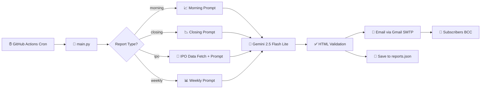

# 📈 Indian Market Intelligence Automation

[](https://python.org)
[](https://aistudio.google.com/)
[](https://github.com/features/actions)
[](https://mail.google.com)
[](https://buymeacoffee.com/tbhavar)

An AI-powered automation engine that scrapes live Indian stock market data, processes sentiment via **Gemini 2.5 Flash Lite**, and dispatches professional HTML briefings to subscribers throughout the trading day.

---

## 🚀 Overview

This system eliminates manual research by aggregating news from top-tier financial sources and social platforms, using LLMs to extract actionable insights. It delivers **four distinct report types** — Morning Bell, Closing Bell, IPO Intelligence, and a Weekly Market Recap.

### ✨ Key Features

| Feature | Description |
| :--- | :--- |
| 🤖 **AI Synthesis** | Gemini 2.5 Flash Lite for rapid context extraction with structured table formatting |
| 📰 **Multi-Source Scraping** | Aggregates data from Moneycontrol, CNBC TV18, NSE & BSE |
| 💬 **Sentiment Analysis** | Scans social metrics from X (Twitter), Reddit & LinkedIn |
| 📊 **FII/DII Flows** | Tracks Foreign & Domestic Institutional Investor buy/sell data |
| 🏭 **Sectoral Analysis** | Top gaining/losing sectors across IT, Banking, Pharma, Auto, etc. |
| 🔁 **Retry Logic** | 3 attempts with exponential backoff on AI generation failures |
| ⚠️ **Error Alerts** | Admin receives email notifications on report generation failures |
| 📋 **HTML Validation** | Reports are validated before dispatch to prevent garbled emails |
| 📝 **Structured Logging** | Timestamped logging across all modules for easy debugging |
| ☁️ **Serverless Execution** | Runs entirely on GitHub Actions — zero hosting costs |
| 👥 **Subscriber Management** | Google Sheets-powered subscription via Google Form (max 90) |
| 📁 **Rolling Archive** | Last 7 reports per type saved & displayed on the landing page |

---

## 📅 Schedule & Workflow

The automation is split into four workflows, all orchestrated via GitHub Actions:

| Report | Command | Cron (UTC) | 🕐 IST Target | Frequency |
| :--- | :--- | :--- | :--- | :--- |
| 📈 **Morning Briefing** | `main.py --type morning` | `15 3 * * *` | 09:30 AM | Daily |
| 📉 **Closing Bell** | `main.py --type closing` | `0 10 * * *` | 03:45 PM | Daily |
| 🚀 **IPO Intelligence** | `main.py --type ipo` | `30 2 * * *` | 08:00 AM | Daily |
| 📊 **Weekly Recap** | `main.py --type weekly` | `15 10 * * 5` | 04:00 PM | Fridays |

> All workflows run in sync with market days. Each workflow auto-commits a `reports.json` archive back to the repo after a successful run.

---

## 🛠️ Setup Instructions

### 1. 🔑 Repository Secrets

Navigate to `Settings > Secrets and variables > Actions` and add:

| Secret Name | Description | Example |
| :--- | :--- | :--- |
| `GEMINI_API_KEY` | Google AI Studio API Key | `AIzaSy...` |
| `EMAIL_SENDER` | Gmail account sending the mail | `bot@gmail.com` |
| `EMAIL_PASSWORD` | Gmail **App Password** (16 digits) | `abcd efgh ijkl mnop` |
| `IPOALERTS_API_KEY` | API key for IPO data (ipoalerts.in) | `abc123...` |
| `SUBSCRIBERS_CSV_URL` | Published Google Sheets CSV URL | `https://docs.google.com/...` |
| `GOOGLE_FORM_URL` | Google Form for subscribe/unsubscribe | `https://forms.gle/...` |

### 2. 🧠 Google AI Studio
1. Visit [Google AI Studio](https://aistudio.google.com/).
2. Generate an API Key — the system uses `gemini-flash-lite-latest` (currently points to Gemini 2.5 Flash Lite Preview).

### 3. 📧 Gmail App Password
1. Go to your Google Account Security settings.
2. Enable **2-Factor Authentication**.
3. Search for **App Passwords**.
4. Create a new one named "Market Bot" and copy the 16-character code.

### 4. 📋 Google Sheets Subscriber List
The Google Sheet should have the following column order:

| Timestamp | Email Address | Action | Feedback | Column 4 | Name |
| :--- | :--- | :--- | :--- | :--- | :--- |

Publish the sheet as CSV and add the URL to the `SUBSCRIBERS_CSV_URL` secret.

---

## 📂 Project Structure

```
📦 Daily-Indian-Market-Briefing
├── 📄 main.py                          # Entry point (e.g. python main.py --type morning)
├── 📄 reports.json                     # Rolling archive (auto-generated, last 7 per type)
├── 📄 index.html                       # Landing page with report archive
├── 📄 requirements.txt                 # Python dependencies
├── 📂 src/
│   ├── 📄 prompts.py                   # AI prompts (morning, closing, IPO, weekly)
│   ├── 📄 data_fetcher.py              # Live IPO data fetcher
│   └── 📄 utils.py                     # GenAI client, email, retry, logging, error alerts
├── 📂 templates/
│   ├── 📄 morning.html                 # Morning email template (blue header)
│   ├── 📄 closing.html                 # Closing email template (green header)
│   ├── 📄 ipo.html                     # IPO email template (dark header)
│   └── 📄 weekly.html                  # Weekly recap template (purple header)
└── 📂 .github/workflows/
    ├── 📄 morning_briefing.yml         # Daily 09:30 AM IST (Scheduled 08:45 AM)
    ├── 📄 closing_bell.yml             # Daily 03:45 PM IST (Scheduled 03:30 PM)
    ├── 📄 ipo_daily.yml                # Daily 08:00 AM IST (Scheduled 08:00 AM)
    └── 📄 weekly_recap.yml             # Fridays 04:00 PM IST (Scheduled 03:45 PM)
```

---

## 🔄 How It Works



---

## 🌐 Landing Page

The `index.html` landing page includes:
- ✨ Feature overview and subscription CTA
- 📁 **Recent Reports Archive** — dynamically loads from `reports.json` with filterable tabs (Morning, Closing, IPO, Weekly)
- ☕ Buy Me a Coffee support button
- 👤 Author profile with link to [tbhavar.in](https://tbhavar.in)

---

## ⚖️ Disclaimer

*This project is for educational and informational purposes only. The automated reports do not constitute financial, investment, or trading advice. Always verify data and consult a SEBI-registered advisor before trading. Past performance is not indicative of future results.*

---

<p align="center">
  Made with ❤️ by <a href="https://tbhavar.in"><strong>CA Tanmay R Bhavar</strong></a>
</p>
